Bu dökümantasyonda tasarladığım kütüphane otomasyonun nasıl kullanılacağını ve hangi işlevlere sahip olduğunu göstereceğim.

**Giriş Ekranı :**

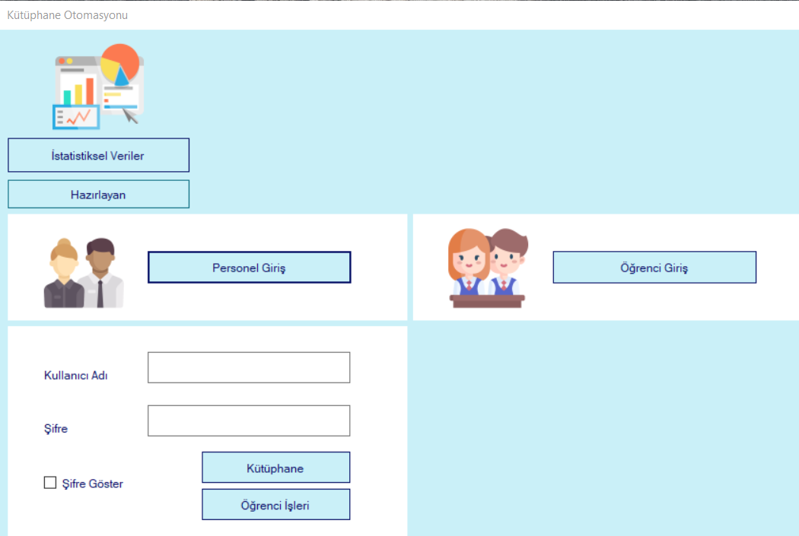

Otomasyonu açtıktan sonra karşımıza çıkan ilk ekran giriş ekranıdır.Bu ekrandan iki farklı giriş yapılmaktadır.Personel girişi kısmında öğrenci işleri personeli ve kütüphane personeli olarak iki farklı alt giriş seçeneği vardır.Gerekli parametreler girildikten sonra veri-tabanından kontroller yapılır ve kullanıcı girişi başarıyla yapılır.

**Giriş Ekranı (İstatistiksel Veriler) :**
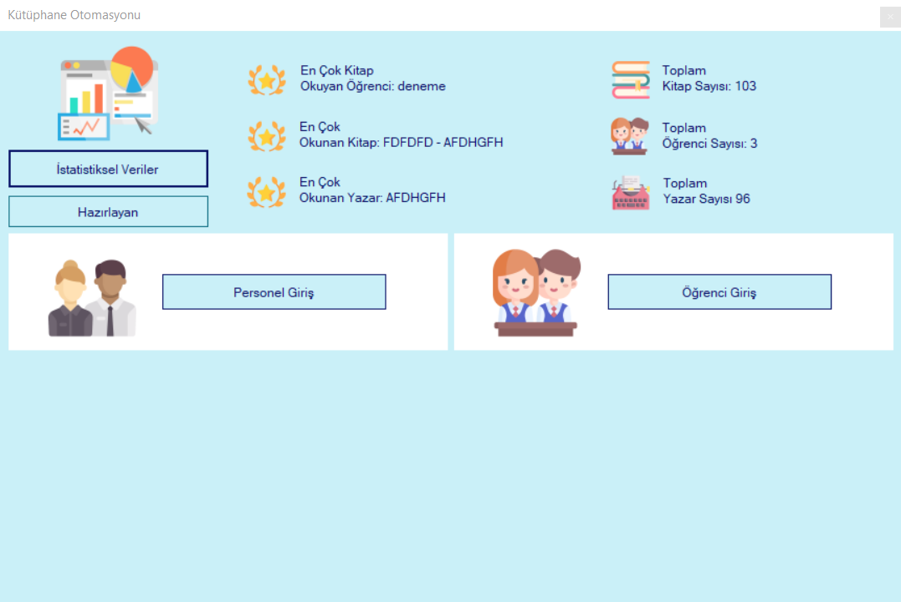

Giriş ekranında bulunan İstatistiksel veriler butonu ile, veri-tabanına kayıtlı veriler ile alakalı istatistiklere ulaşabiliriz.

**Personel Ana Ekranı (Öğrenci) :**

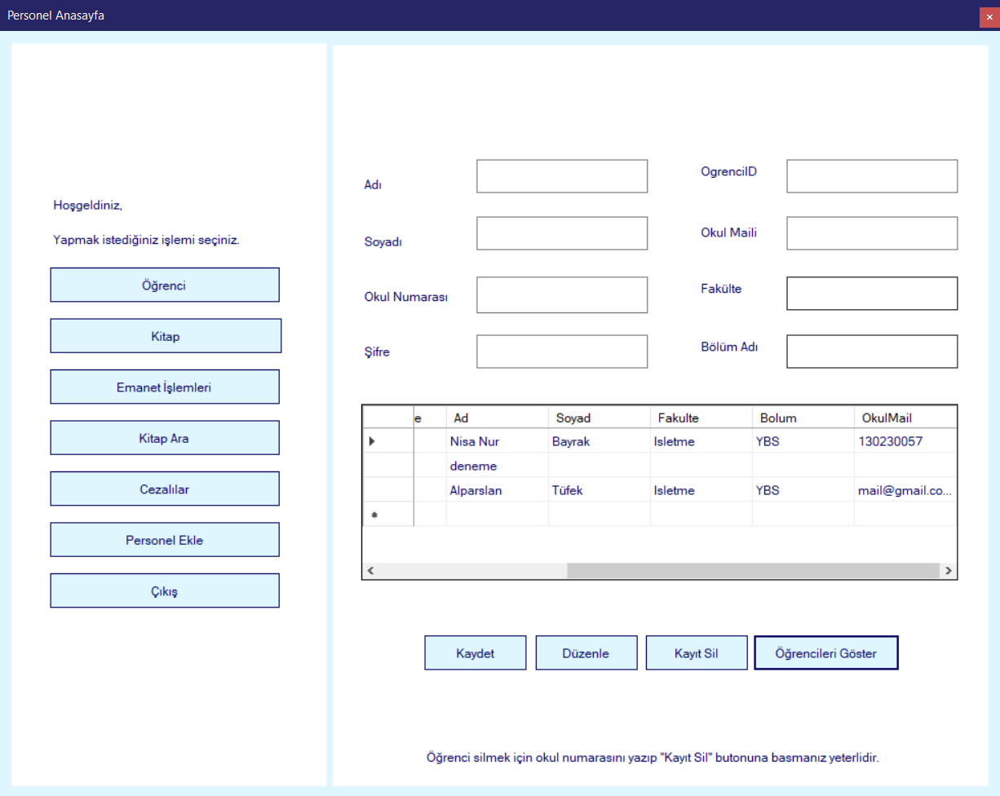
Bu ekrandan öğrenci ekleme, düzenleme,silme ve öğrenci arama işlemleri gerçekleştirilebilir.Öğrenci eklemek için gereken parametreler ekte gözükmektedir.Bu işlemler gerçekleştirilken doğrudan veri-tabanında güncellemeler yapılmaktadır.

**Personel (Kitap) :**

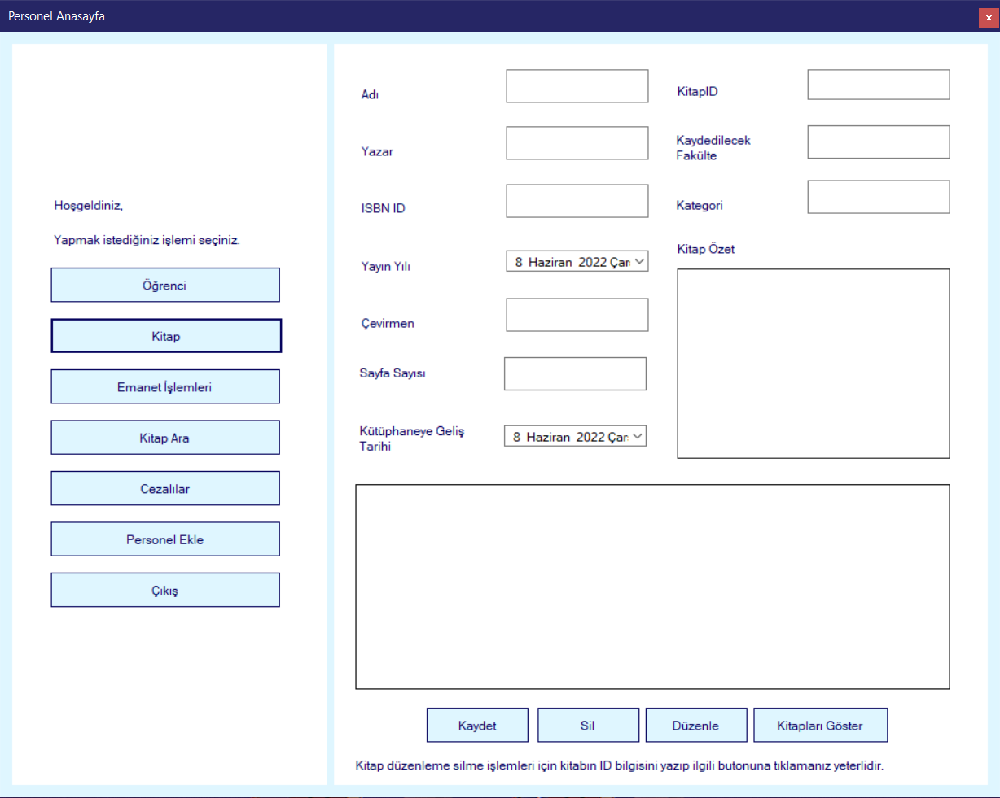
Personel ekranının bir diğer ekranı ise kitap ekranıdır. Bu ekran ile veri-tabanına kitap ekleyebilir, çıkartabilir,düzenleyebilir ve güncel olarak veritabanında bulunan kitapları arayabilirsiniz. Kitap eklerken gereken parametreler ekte gözükmektedir.

**Personel (Emanet) :**

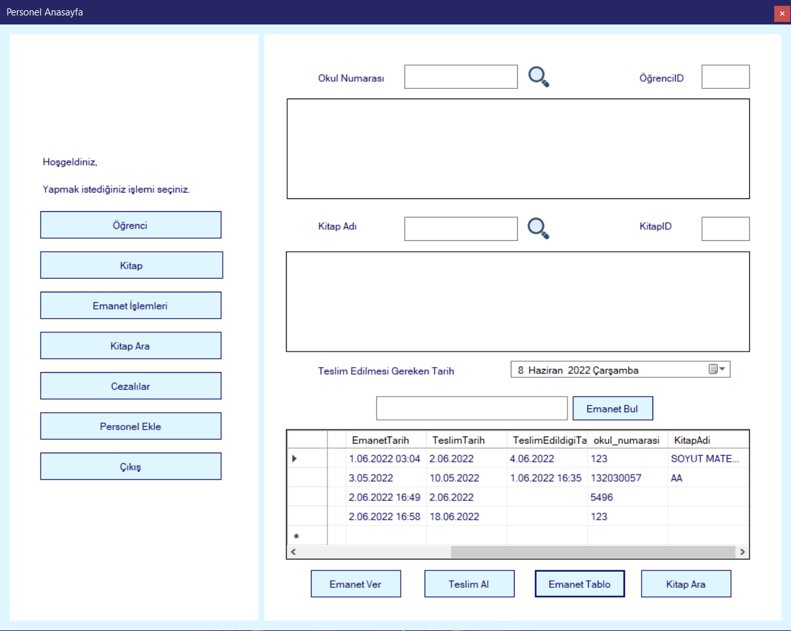
Emanet ekranı bu otomasyonun en çok kullanılan ekranlarından birisidir.Bu ekran üzerinden 3 ana işlem yapılmaktadır.Bu işlemler emanet teslim alma, emanet verme ve emanetleri tablo üzerinde görüntülemedir.
Emanet verme işlemi için ilk adım emanet almak isteyen öğrencinin okul numarası ya da öğrenci id ile öğrenciyi veri-tabanından bulmaktır. İkinci adım ise öğrencinin teslim almak istediği kitabı veritabanından, kitap adı veya kitap id ile bulmaktır.Üçüncü ve son olan adım ise teslim edilen emanetin son teslim tarihinin girilip “Emanet Ver” butonu ile emanet verme işleminin tamamlanmasıdır.
Emanet teslim alma işleminde ise öncelikle emaneti teslim edecek olan öğrencinin okul numarası veya öğrenci id ile veri-tabanından seçilmesi ile başlar.Öğrencinin okul numarası ya da öğrenci idsi ile tespiti yapıldıktan sonra öğrencinin teslim etmek istediği kitap veri-tabanından bulunur ve seçilir.Kitabın teslim tarihi kontrol edildikten sonra “Teslim Al” butonu ile teslim işlemi tamamlanır.
Emanet tablo işleminde hangi öğrencinin hangi kitabı emanet aldığını ve emanet alınan kitabın teslim tarihini veri-tabanı üzerinden görülebilmektedir.

**Personel(Kitap Ara) :**

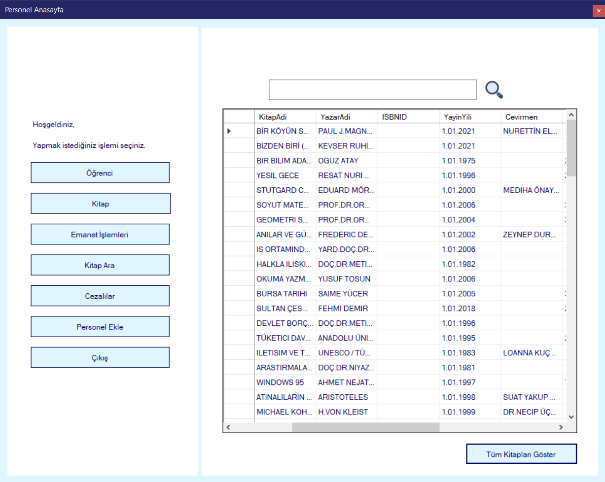
Bu ekrandan veri-tabanında kayıtlı olan bütün kitaplar görüntülünebilir ve veri-tabanı üzerinde kitap araması yapılabilir.

**Personel (Cezalılar) :**

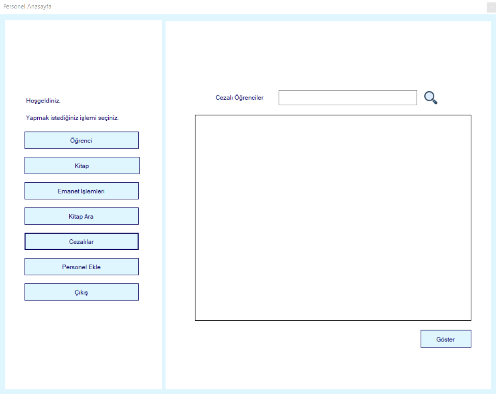
Bu ekrandan emaneti zamanında teslim etmemiş öğrencilerin listesine ulaşılabilir.Cezalı öğrenciler arasından aramalar yapılabilir.

**Personel (Personel Ekle) :**

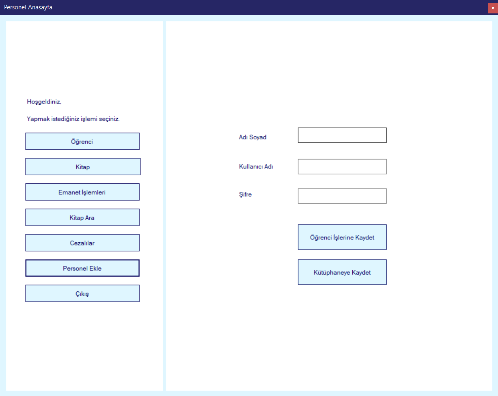
Bu ekrandan yeni personeller gerekli parametreler alınarak veri-tabanına iki şekilde (Öğrenci işleri,kütüphane personel) eklenilebilir.

**Öğrenci İşleri Ana Sayfa :**

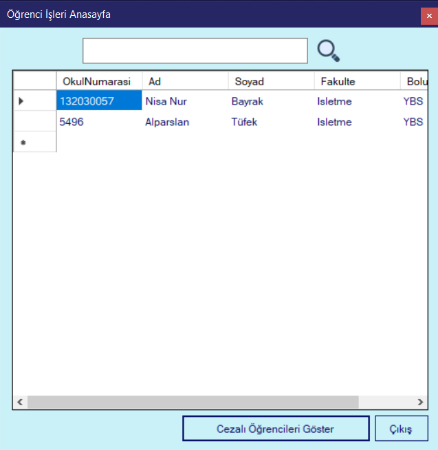
Öğrenci işleri ana sayfasından cezalı öğrenciler görüntülenebilir. Cezalı öğrencilerin cezası kalkmaz ise diploma alma haklarını ceza kalkana dek kaybederler.

**Öğrenci (Ceza Kontrol) :**

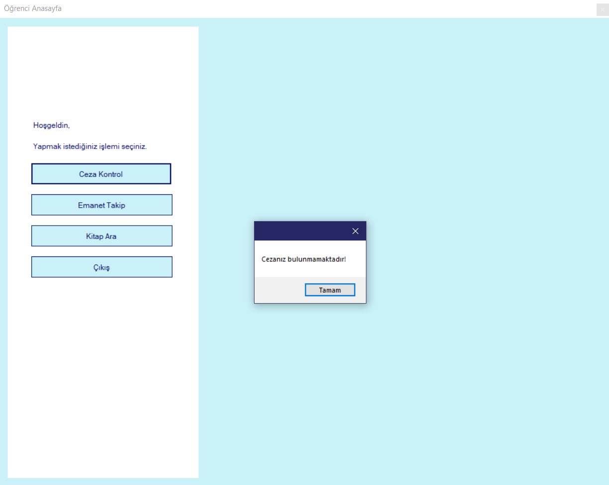

Öğrenci girişi yapıldıktan sonra karşımıza böyle bir ekran gelmektedir. Öğrenci ekranının ceza kontrol işlemidir.Eğer ki öğrenci cezalı ise ceza kontrol butonunu kullandıktan sonra karşısına kendisinin cezalı olup olmadığıyla alakalı bilgi veren bir uyarı mesajı çıkmaktadır.

**Öğrenci (Kitap Ara) :**
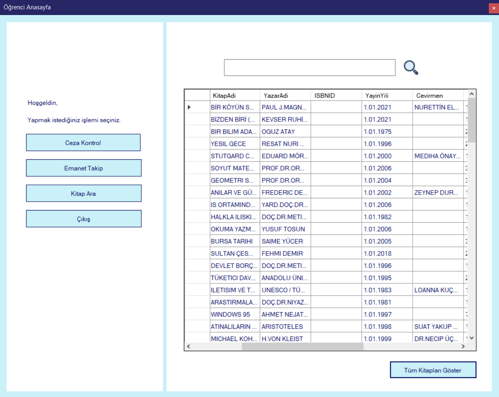

Öğrenciler bu ekrandan veri-tabanında kayıtlı olan kitaplar arasında arama yapılabilir.

**Öğrenci (Emanet Takip) :**

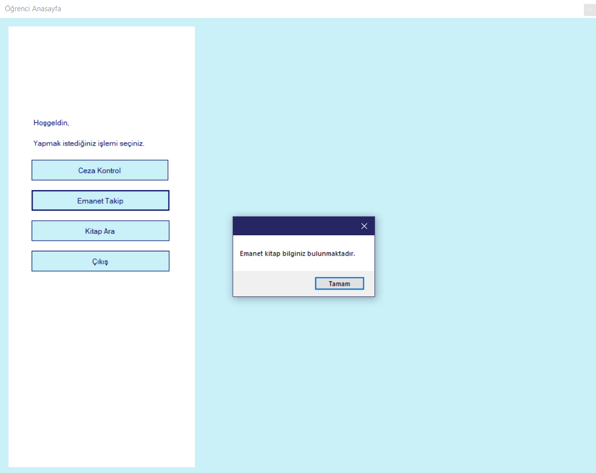
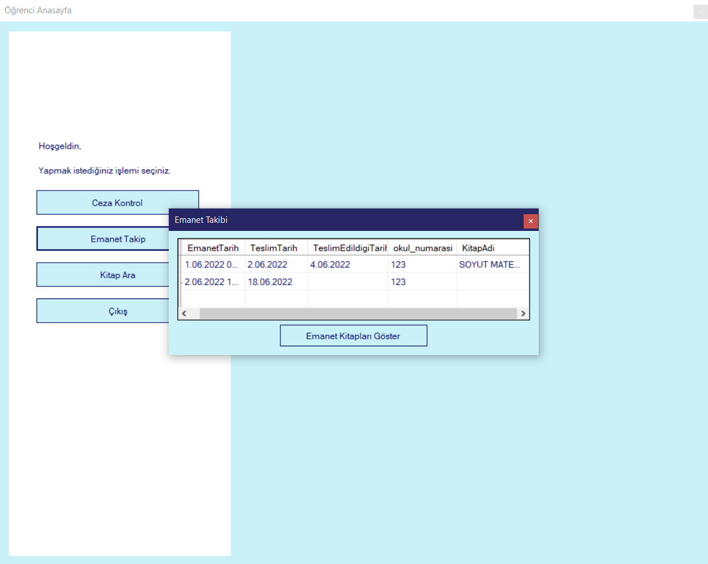

Öğrenci emanetlerini emanet takip butonu ile görüntüleyebilir. Eğer ki herhangi bir emanet almadıysa bununla alakalı bir uyarı mesajı alır. Eğer emanet aldıysa emanet bilgilerini görüntüleyebilir.

